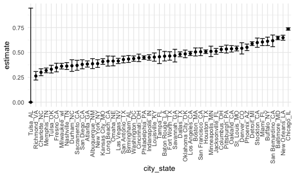
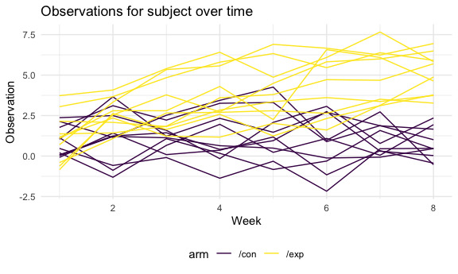
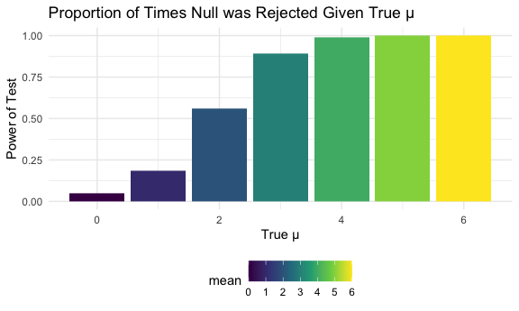
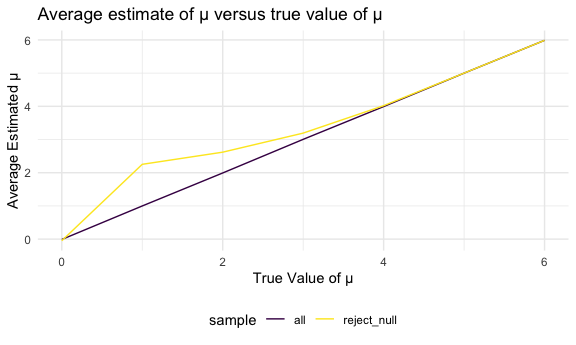

Homework 5 Iteration
================
Ayeshra Acharya
11/18/2020

## Problem 1 - Homicides in 50 Large U.S. Cities

### Read in and clean data

``` r
homicide_df = 
  read.csv("./data/homicide-data.csv") %>%
  mutate(
    resolved = case_when(
      disposition == "Closed without arrest" ~ "unsolved",
      disposition == "Open/No arrest" ~ "unsolved",
      disposition == "Closed by arrest" ~ "solved"
    ),
    city_state = str_c(city,state,sep = "_")
  ) %>%
  select(city_state, resolved) %>%
  filter(city_state !="Tulsa AL")
```

### Aggregate

``` r
aggregate_df = 
  homicide_df %>% 
  group_by(city_state) %>% 
  summarize(
    hom_total = n(),
    hom_unsolved = sum(resolved == "unsolved")
  )
```

    ## `summarise()` ungrouping output (override with `.groups` argument)

### Prop Test for Baltimore

``` r
prop.test(
  aggregate_df %>% filter(city_state == "Baltimore_MD") %>% pull(hom_unsolved),
    aggregate_df %>% filter(city_state == "Baltimore_MD") %>% pull(hom_total)) %>% 
  broom::tidy()
```

    ## # A tibble: 1 x 8
    ##   estimate statistic  p.value parameter conf.low conf.high method    alternative
    ##      <dbl>     <dbl>    <dbl>     <int>    <dbl>     <dbl> <chr>     <chr>      
    ## 1    0.646      239. 6.46e-54         1    0.628     0.663 1-sample… two.sided

### Iteration All Cities

``` r
results_df = 
  aggregate_df %>% 
  mutate(
     prop_tests = map2(.x = hom_unsolved, .y = hom_total, ~prop.test(x = .x, n = .y)),
     tidy_tests = map(.x = prop_tests, ~broom::tidy(.x))
   ) %>% 
  select(-prop_tests) %>% 
  unnest(tidy_tests) %>% 
  select(city_state, estimate, conf.low, conf.high)
```

    ## Warning: Problem with `mutate()` input `prop_tests`.
    ## ℹ Chi-squared approximation may be incorrect
    ## ℹ Input `prop_tests` is `map2(.x = hom_unsolved, .y = hom_total, ~prop.test(x = .x, n = .y))`.

    ## Warning in prop.test(x = .x, n = .y): Chi-squared approximation may be incorrect

``` r
results_df %>% 
  mutate(city_state = fct_reorder(city_state, estimate)) %>% 
  ggplot(aes(x = city_state, y = estimate)) +
  geom_point() +
  geom_errorbar(aes(ymin = conf.low, ymax = conf.high)) +
  theme(axis.text.x = element_text(angle = 90, vjust = 0.5, hjust = 1))
```



## Problem 2 - Longitudional Study

``` r
data_1 = read_csv("long_data/con_01.csv")
```

    ## Parsed with column specification:
    ## cols(
    ##   week_1 = col_double(),
    ##   week_2 = col_double(),
    ##   week_3 = col_double(),
    ##   week_4 = col_double(),
    ##   week_5 = col_double(),
    ##   week_6 = col_double(),
    ##   week_7 = col_double(),
    ##   week_8 = col_double()
    ## )

### Tidying data

``` r
path_df = 
  tibble(
    path = list.files("long_data")
  ) %>% 
  mutate(
    path = str_c("long_data/", path),
    data = map(path, read_csv)) %>% 
  unnest(data) %>%
  separate(path, into = c("folder", "arm"), sep = 9) %>%
  separate(arm, into = c("arm", "id"), sep = "_") %>% 
  separate(id, into = c("id", "na"), sep = 2) %>% 
  select(-folder, -na) %>% 
  pivot_longer(
    week_1:week_8,
    names_to = "week", 
    values_to = "observation",
    names_prefix = "week_"
  ) %>%
  mutate(
    id = str_remove(id, "^0+"),
    week = as.numeric(week),
    subject_id = str_c(arm, id, sep = "_")
    ) %>% 
  select(-id)

path_df
```

    ## # A tibble: 160 x 4
    ##    arm    week observation subject_id
    ##    <chr> <dbl>       <dbl> <chr>     
    ##  1 /con      1        0.2  /con_1    
    ##  2 /con      2       -1.31 /con_1    
    ##  3 /con      3        0.66 /con_1    
    ##  4 /con      4        1.96 /con_1    
    ##  5 /con      5        0.23 /con_1    
    ##  6 /con      6        1.09 /con_1    
    ##  7 /con      7        0.05 /con_1    
    ##  8 /con      8        1.94 /con_1    
    ##  9 /con      1        1.13 /con_2    
    ## 10 /con      2       -0.88 /con_2    
    ## # … with 150 more rows

### Creating spaghetti plot

``` r
path_df %>% 
  ggplot(aes(x = week, y = observation, color = arm, group = subject_id)) +
  geom_path() +
  labs(
    title = "Observations for subject over time",
    x = "Week", 
    y = "Observation"
  )
```



This graph shows us that the subjects in the experimental arm had more
observations than subjects in the control arm. In the beginning of the
study, the observations are more similar between the experimental and
control, and as the weeks go on, they diverge. Also, it appears that the
observations for the experimental arm are decreasing over time,

## Problem 3 - False Null Hypothesis

### T-test function

``` r
t_test = function(sample_size = 30, mu, sigma = 5) {
  simulation = 
    tibble(x = rnorm(n = sample_size, mean = mu, sd = sigma))
  simulation %>% 
  t.test() %>% 
  broom::tidy()
}
```

### Setting mu = 0

``` r
sim_results = 
  rerun(5000, t_test(mu = 0)) %>% 
  bind_rows()
sim_results %>% 
  select(estimate, p.value)
```

    ## # A tibble: 5,000 x 2
    ##    estimate p.value
    ##       <dbl>   <dbl>
    ##  1    2.85  0.00709
    ##  2   -1.31  0.179  
    ##  3    1.69  0.0833 
    ##  4   -0.611 0.569  
    ##  5   -1.52  0.0974 
    ##  6    1.10  0.200  
    ##  7    0.622 0.476  
    ##  8   -0.320 0.718  
    ##  9   -0.743 0.365  
    ## 10   -1.45  0.139  
    ## # … with 4,990 more rows

### Repeating above for 1-6

``` r
rep_sim = 
  tibble(mean = c(0, 1, 2, 3, 4, 5, 6)) %>% 
  mutate(
    output_lists = map(.x = mean, ~rerun(5000, t_test(mu = .x))),
    estimate_dfs = map(output_lists, bind_rows)) %>% 
  select(-output_lists) %>% 
  unnest(estimate_dfs)
rep_sim %>% 
  select(mean, estimate, p.value)
```

    ## # A tibble: 35,000 x 3
    ##     mean estimate p.value
    ##    <dbl>    <dbl>   <dbl>
    ##  1     0  -1.04    0.306 
    ##  2     0  -0.0588  0.952 
    ##  3     0  -0.421   0.672 
    ##  4     0  -0.813   0.362 
    ##  5     0  -0.434   0.571 
    ##  6     0   0.202   0.810 
    ##  7     0   0.470   0.619 
    ##  8     0  -0.132   0.882 
    ##  9     0  -2.26    0.0350
    ## 10     0   1.62    0.0973
    ## # … with 34,990 more rows

### Plot of proportion of times the null was rejected

``` r
rep_sim %>% 
  select(mean, estimate, p.value) %>% 
  group_by(mean) %>% 
  summarize(prop_reject = sum(p.value <= 0.05) / n()) %>% 
  ggplot(aes(x = mean, y = prop_reject, fill = mean)) +
  geom_bar(stat = 'identity') +
  labs(
    title = "Proportion of Times Null was Rejected Given True µ",
    x = "True µ",
    y = "Power of Test"
  )
```

    ## `summarise()` ungrouping output (override with `.groups` argument)



As we can see from this plot, the power of the test increases as the
true mean increases, further away from 0.

### Plot of the average estimate of μ̂ on the y axis and the true value of μ on the x axis.

### Overlay the average estimate of μ̂ only in samples for which the null was rejected on the y axis and the true value of μ on the x axis.

``` r
all_samples = 
  rep_sim %>%
  select(mean, estimate, p.value) %>% 
    group_by(mean) %>% 
    summarize(all = mean(estimate))
```

    ## `summarise()` ungrouping output (override with `.groups` argument)

``` r
rejected_null = 
  rep_sim %>%
  select(mean, estimate, p.value) %>% 
    filter(p.value <= 0.05) %>% 
    group_by(mean) %>% 
    summarize(reject_null = mean(estimate))
```

    ## `summarise()` ungrouping output (override with `.groups` argument)

``` r
left_join(all_samples, rejected_null, by = "mean") %>% 
  pivot_longer(
    all:reject_null,
    names_to = "sample",
    values_to = "average_estimate"
  ) %>% 
  ggplot(aes(x = mean, y = average_estimate, color = sample)) +
  geom_line() +
  labs(
    title = "Average estimate of µ versus true value of µ",
    x = "True Value of µ",
    y = "Average Estimated µ"
  )
```



From the plot above, we can see that for all samples, the average
estimated mu is correlated to the true value of mu. This is not the case
for samples where the null hypothesis was rejected because until the
point where the true null was equal to 4, the samples with rejected null
did not correlate well with the true value of null.
